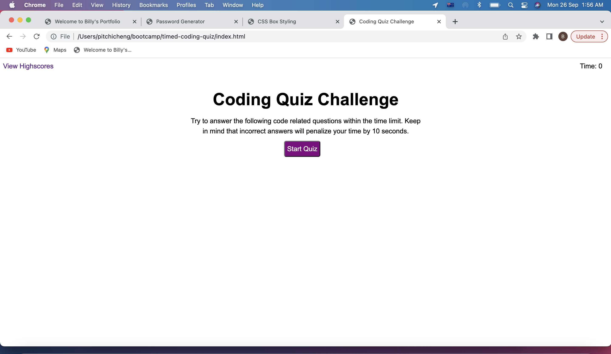
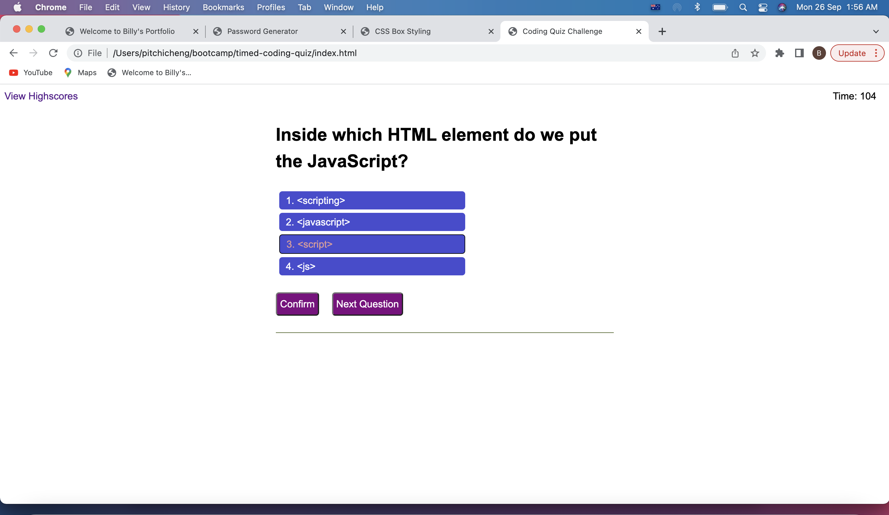
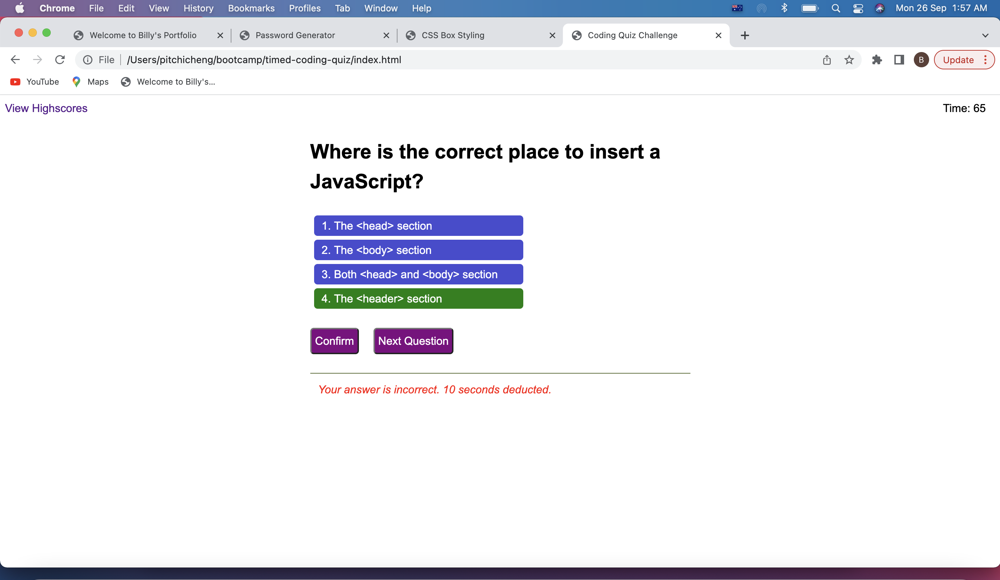
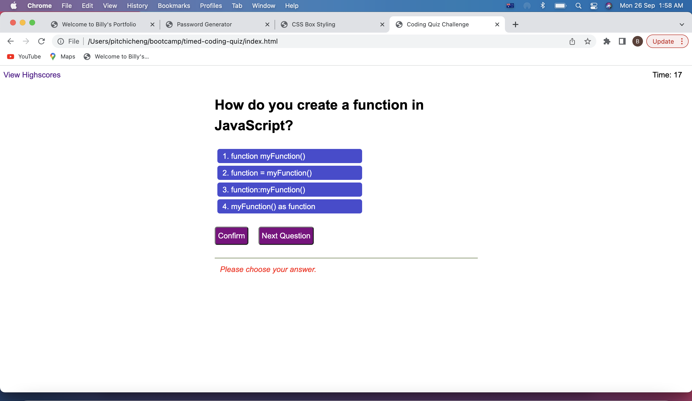
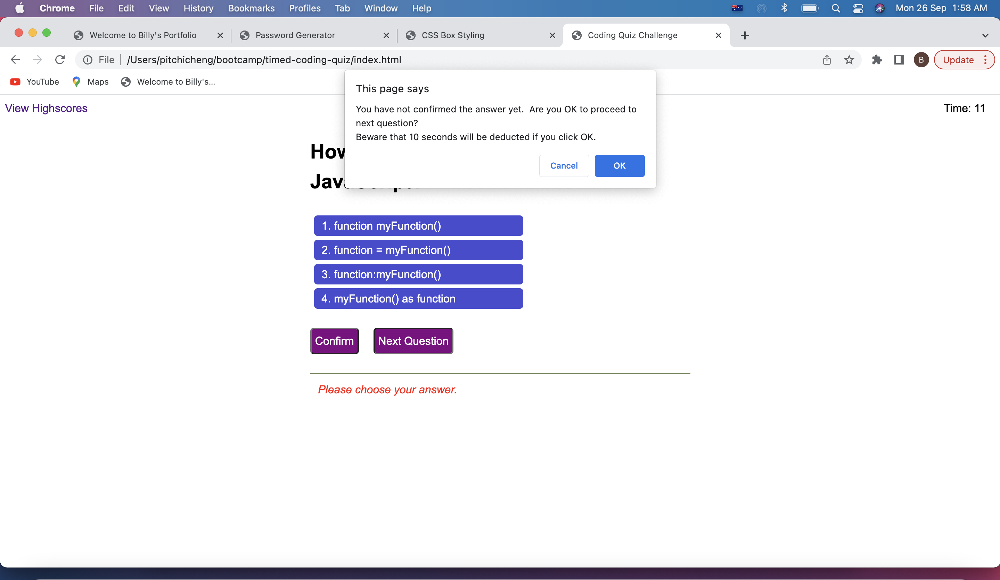
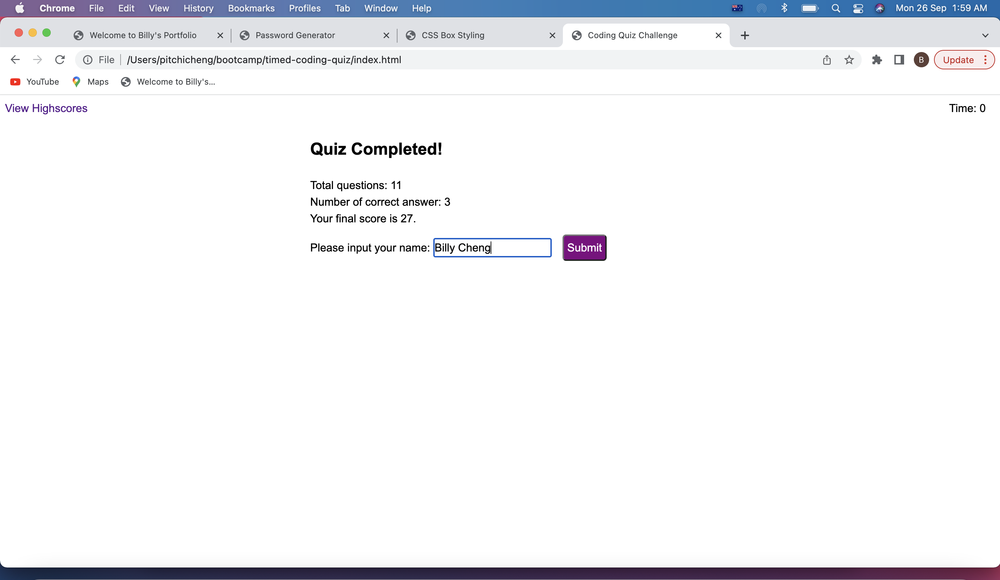
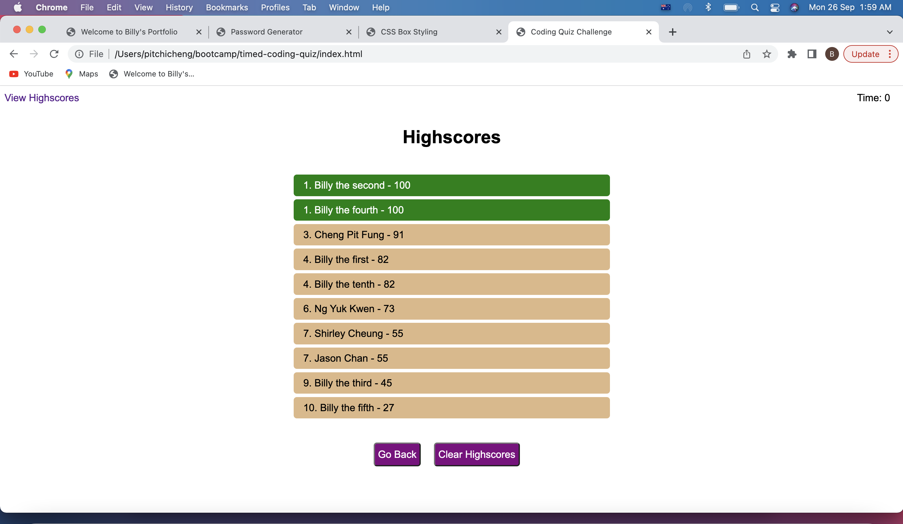

# Timed Coding Quiz Challenge

## Your Task

This is the Challenge after completing the Unit 4 (Web APIs) of Adelaide University Coding Bootcamp.

## User Story

```
AS A coding boot camp student
I WANT to take a timed quiz on JavaScript fundamentals that stores high scores
SO THAT I can gauge my progress compared to my peers
```

## Acceptance Criteria

```
GIVEN I am taking a code quiz
WHEN I click the start button
THEN a timer starts and I am presented with a question
WHEN I answer a question
THEN I am presented with another question
WHEN I answer a question incorrectly
THEN time is subtracted from the clock
WHEN all questions are answered or the timer reaches 0
THEN the game is over
WHEN the game is over
THEN I can save my initials and my score
```


## Solution

Steps to resolve the Challenge:

1. Create the web page structure and style by editing HTML and CSS file. 

2. Add responsive design for differnt screen widths.  

3. Edit the script.js.  Add the click event for each buttons and implement the screen flow when clicking each buttons. 

4. Add timer function to countdown after starting the quiz. 

5. Add functions to show different question and answers on the screens.  

6. Add functions for user to select the answer and check the correctnes of the answers.  If the answer is right, store the number of correct answers.  If it is wrong, deduct the time by 10 seconds. 

7. Add functions for displaying the result page after the last question answered or times up.  Allow users to enter the name and save highscores.  When saving the highscores, sort and rank the highscores list. 

8. Add functions to render and display the highscores list and clear highscores.  Add logics to identify which screen need to go back when user clicks the "Go Back" button. 

9. Add validations and checkings to the program to avoid wrong user inputs and operations causing errors to the program. 

<br>

## Test Cases and Result

| Test Case | Testing Criteria                                                                    | Expected Result                                                                                         | Actual Result | Result |
|:---------:|-------------------------------------------------------------------------------------|---------------------------------------------------------------------------------------------------------|:-------------:|:------:|
|     1     | Click "Start Quiz" button                                                           | The timer starts to countdown the time. The first question with answer options are shown on the screen. |  As expected  |  Pass  |
|     2     | Click one of the answer for the question.                                           | The selected answer is highlighted with another color.                                                  |  As expected  |  Pass  |
|     3     | Click "Confirm" button after selecting the correct answer.                          | A message is shown to notify user the answer is correct.                                                |  As expected  |  Pass  |
|     4     | Click "Confirm" button after selecting the wrong answer.                            | A message is shown to notify user the answer is wrong.  Deduct the time by 10 seconds.                  |  As expected  |  Pass  |
|     5     | Click "Next Question" button after answering the questions                          | Next question is shown on the screen.                                                                   |  As expected  |  Pass  |
|     6     | Click "Next Question" on the last question.                                         | The result screen is shown with final score.                                                            |  As expected  |  Pass  |
|     7     | On the result screen, enter the name and click "Submit" button.                     | The result should be saved and an ordered Highscores List is shown on the screen.                       |  As expected  |  Pass  |
|     8     | Click "Clear Highscores" button.                                                    | The Highscores List is removed from the screen.                                                         |  As expected  |  Pass  |
|     9     | Click "View Highscores" button on the welcome page and then click "Go Back" button. | The Highscores List is shown and go back to welcome screen after clicking "Go Back" button.             |  As expected  |  Pass  |
|     10    | Click "View Highscores" button on the question page and then click "Go Back" button | The Highscores List is shown and go back to question screen after clicking "Go Back" button.            |  As expected  |  Pass  |
|     11    | Click "View Highscores" button on the result page and then click "Go Back" button.  | The Highscores List is shown and go back to result screen after clicking "Go Back" button.              |  As expected  |  Pass  |
|     12    | Click "Confirm" button without selecting the answer.                                | A message is shown to ask the user to select an answer.                                                 |  As expected  |  Pass  |
|     13    | Click "Confirm" after answering the question.                                       | A message is shown to notify user the question is already answered.                                     |  As expected  |  Pass  |
|     14    | Click "Next Question" without answering and confirming the question.                | A message is shown to ask user whether he wants to skip the question.                                   |  As expected  |  Pass  |
|     15    | On the result page, click "Submit" without inputing the name.                       | A message is shown to ask user to input the name.                                                       |  As expected  |  Pass  |

<br>

## Live URL 

https://chengpitchi.github.io/timed-coding-quiz/
<br>

## Screenshots for the Solution


<br>

<br>

<br>

<br>

<br>

<br>

<br>

<br>

## Installation

No Installation requried.

## License 

Not Applicable
